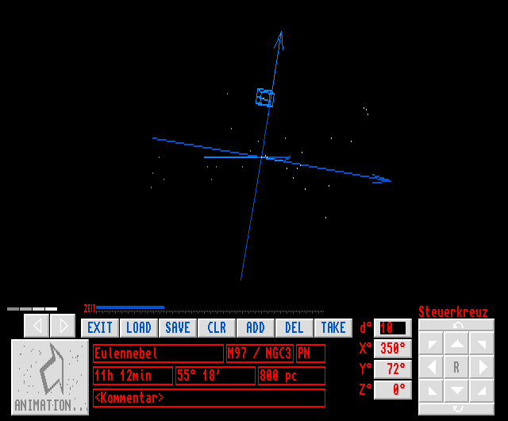

# DeO

In 1993 I published my first computer program. It was a **d**ata visualization tool for **e**xtragalactic **o**bjects. I wrote it in Assembler on my Commodore Amiga 2000. It was included on the freeware floppy disk series TIME DISK 182.

I developed this program as a project work in astronomy in High School (German: Gymnasium). At that time I found a 3D-to-2D algorithm in a 'grey' hacker magazine for fans of the C64. I used this article to implement an appropriate algorithm in m68k Assembler for my Amiga computer.

Herewith I release this software under the GNU GPL version 3. Unfortunately I am still looking for the source code. Back then I used the Assembler Devpac 3 to write DeO. In the unlikely case that you are interested in the source code, I encourage you to disassemble the program. If you succeed, I would be happy to get the recovered source code and add it to this repository. 

## Known Issues
Displaying images: to display images, DeO uses the **display** command, which was included in AmigaOS 2.x. It only works if DeO was started from the shell. 

## Additional data
Eulennebel.iff (Public Domain, source: https://commons.wikimedia.org/wiki/File:M97-stargazer-obs.jpg)

## Disclaimer
At the time of publication in 1993, I was not aware that "Deo" was the word for God in the Latin language. However, considering the fact that the program places the viewer outside the extragalactic space, one could suspect an allusion here. This is a completely unintentional coincidence.
